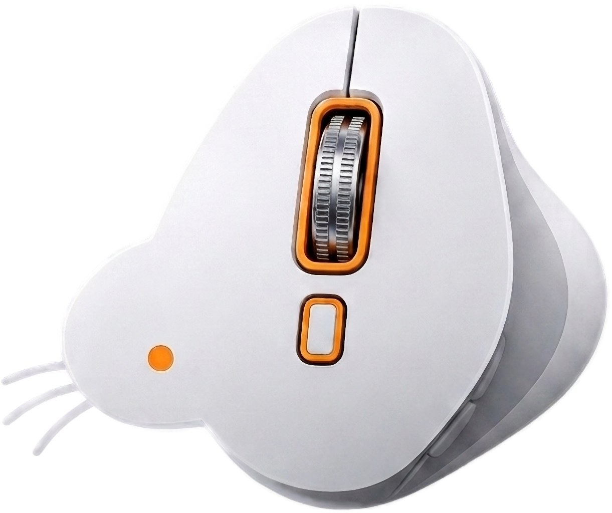
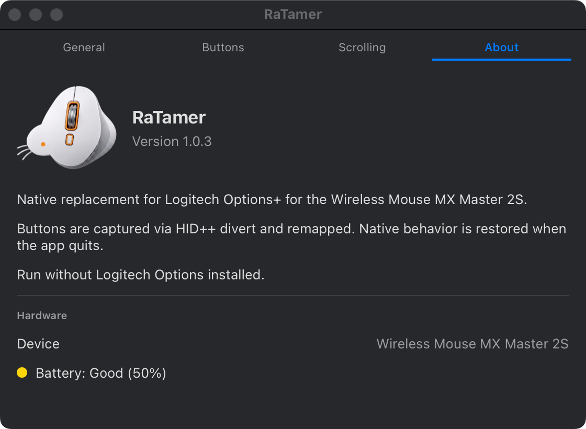
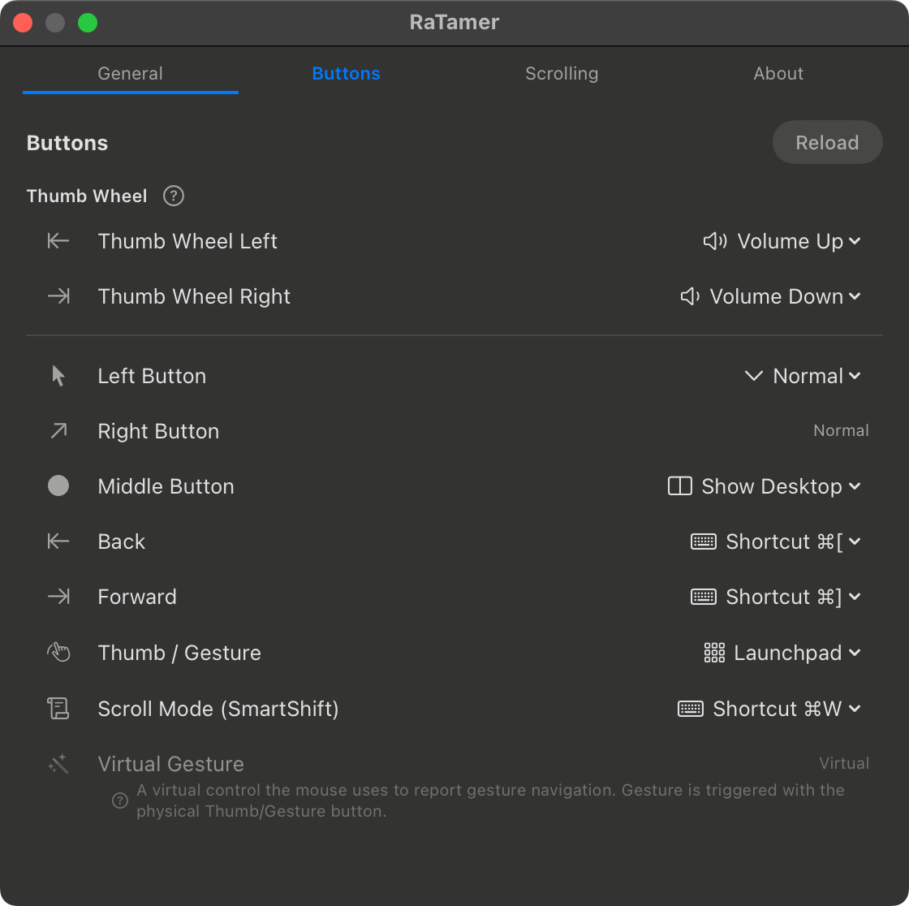
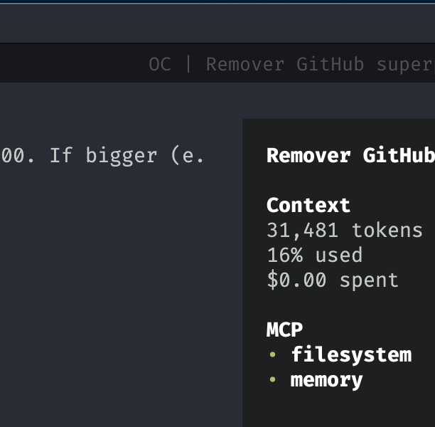

# RatTamer

A native macOS menu bar app that replaces Logitech Options+ for the MX Master 2S. It captures the mouse buttons over HID++ 2.0 and runs your own shortcut, system action or click for each one — no Logitech software required, native behavior restored on quit.


[](screenshots/settings-about.png)

## Download

Grab the latest pre-built app from the [Releases page](https://github.com/gilsonolegario/RaTamer/releases) — or build it locally:

```bash
./scripts/build-app.sh    # produces build/RatTamer.app (ad-hoc signed)
```

or run straight from the source tree:

```bash
swift run RatTamer        # development mode, no app bundle
```

The bundle is only needed for "Start at login" (via `SMAppService`). See [Distribution](#distribution) for the notarization caveats of the pre-built download.

## Major features

- **Menu bar popover** with connection status, battery level, pointer resolution and a remapping toggle.
- **Button remapping** — per-button actions: keyboard shortcuts, system actions, clicks, gestures.
- **DPI cycling** — assign "Cycle DPI" to a button; steps through 1000 / 1600 / 2000 / 4000.
- **Left/right swap** — remaps the physical buttons; native mapping restored on quit.
- **Thumb wheel** — left/right horizontal scroll, each side with its own action.
- **SmartShift** — ratchet / free-spin / auto wheel mode plus sensitivity.
- **Gestures** — raw XY movement classified into directions by the gesture detector.
- **Dock icon** — show in the Dock or run menu bar only (Settings → General).
- **About** — app icon and version in the Settings About tab.
- **Completely free**, native SwiftUI, no daemons, no telemetry.

### Screenshots

[](screenshots/settings-buttons.png)

[](screenshots/menu-bar.png)

## How to install and use the app

1. Build the app: `./scripts/build-app.sh` (or `swift run RatTamer` for development).
2. Copy `build/RatTamer.app` to your Applications folder.
3. Open RatTamer — the first run shows a short onboarding.
4. Grant **Accessibility** in System Settings → Privacy & Security as prompted (required to post shortcuts and clicks).
5. Click the mouse icon in the menu bar to open the popover: connection status, battery, pointer resolution and a remapping toggle.
6. Open **Settings…** to configure buttons, thumb wheel, SmartShift, DPI presets, login item and the Dock icon option.
7. To start at login, toggle "Start at login" in Settings → General or in the popover.

### macOS compatibility

| Version | Notes |
|---|---|
| macOS 14+ (Sonoma) | supported |
| macOS 15 (Sequoia) | tested on 15.7.8, Apple Silicon |

## Configuration

In the **Buttons** tab every divertable button gets an action: Disabled (native), shortcuts (e.g. Cmd+W), system actions (Volume, Mission Control, Show Desktop, Spaces), clicks (Forward/Back), gestures or DPI cycling. The thumb wheel has separate left/right actions, and the SmartShift wheel mode (ratchet, free-spin, auto + sensitivity) is set in the same tab.

The configuration is stored in `~/Library/Application Support/RatTamer/config.json` and applied on connect.

## Distribution

The app is **not notarized** — notarization requires a paid Apple Developer account — so macOS may block a downloaded copy. Two free paths work around that:

1. **Local build (recommended).** Clone the repo and run `./scripts/build-app.sh`; you get `build/RatTamer.app` and "Start at login" works via `SMAppService`. Files built locally never receive the `com.apple.quarantine` attribute, so Gatekeeper stays out of the way. Requires only the Xcode Command Line Tools (already a build requirement).
2. **GitHub Release (convenience).** The app is ad-hoc signed (`codesign -s -`, no identity) and published as a zip. A browser download sets the quarantine attribute, so remove it once:

   ```bash
   xattr -dr com.apple.quarantine RatTamer.app
   ```

   or right-click → Open → Open Anyway in Gatekeeper.

## Documentation

- **How the app works, the config schema, developer tools and build details** — [docs/TECHNICAL.md](docs/TECHNICAL.md)
- **The HID++ protocol, byte by byte** — [docs/HIDPP.md](docs/HIDPP.md)

## History

**0.9.0** — About tab with app icon (160pt) and version; menu bar popover with status, battery, pointer resolution and a remapping toggle; option to hide the Dock icon (menu bar only); DPI cycling (1000/1600/2000/4000); button remapping with left/right swap; thumb wheel actions; SmartShift wheel mode control; gestures; screenshots.

---

Built with [opencode](https://opencode.ai) — the open-source AI coding agent.
